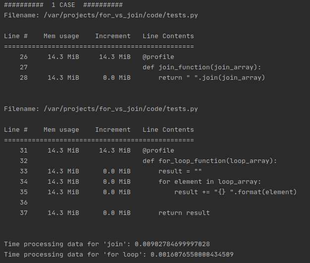
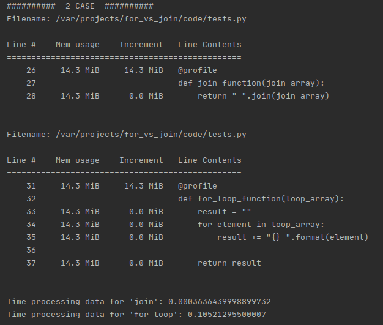
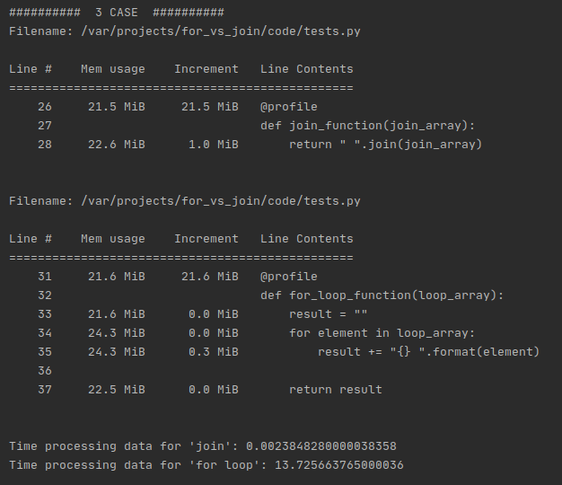
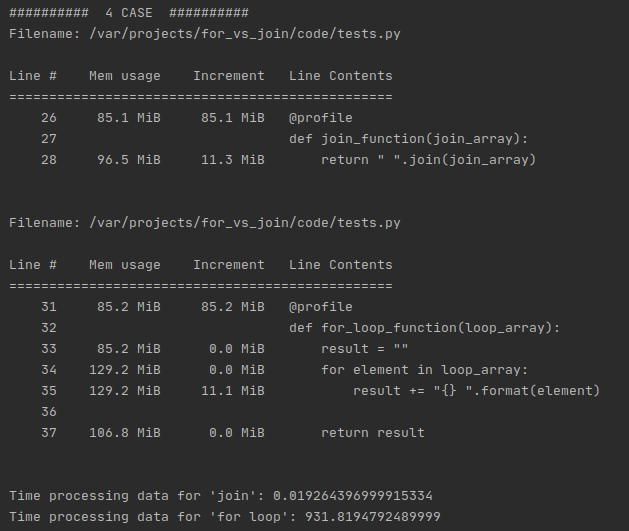

# For vs Join comparation in python.
Comparation between "for" and "join" in python, testing which version is more efficient.

## Requirements
* python >= 3.6
* memory-profiler == 0.57.0

## Installation
In this section installation using virtualenv for linux will be explained.
You must install virtualenv if you have not, you can follow the 
[installation guide](https://virtualenv.pypa.io/en/stable/installation.html).

Once you have virtualenv installed, open the terminal in project's directory and write the following command in terminal

```bash
virtualenv .venv -p $(which python3)
```

To activate the virtualenv:
```bash
source .venv/bin/activate
```

Once we have our virtualenv activated, we can install the requirements.
```bash
pip install -r requirements.txt
```

Now you can run the test with:
```bash
python3 code/tests.py
```

## Tests
In this tests, memory and executing time have being measured in order to obtain which of the two versions, 
'for' or 'join', is more efficient.

Tested arrays will have a changing number of strings, depending on the case.

### Case 1 (Array with 10 elements)


### Case 2 (Array with 1000 elements)


### Case 3 (Array with 100000 elements)


### Case 4 (Array with 1000000 elements)


## Environment
* **OS**: Zorin OS 15.3
* **Memory**: 15.6 GiB
* **Processor**: Intel Core i5-6500 CPU @ 3.20GHz x 4
* **OS Type**: 64-bit
